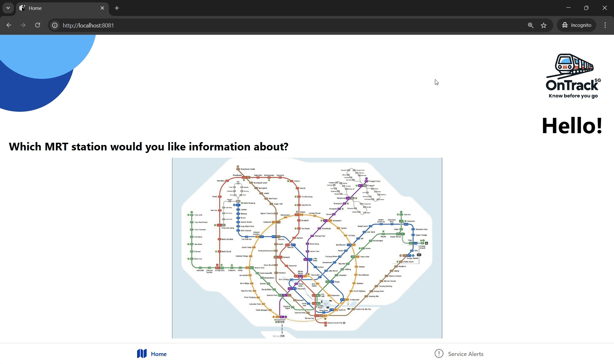

# MRT and LRT Station Information App Read Me file

<p align="center">
  
  
</p>

This project is a mobile application designed to provide users with real-time information about MRT and LRT stations in Singapore. The app includes features such as train timings, crowd levels, and service alerts, making it a useful tool for commuters.

---

## Features

- **Interactive Map**: View MRT and LRT station locations on an interactive map.
- **Train Timings**: Check the first and last train timings for each station.
- **Crowd Levels**: Get real-time crowd level information for selected stations.
- **Service Alerts**: Stay updated with the latest service disruptions and alerts.
- **LRT Maps**: View detailed maps for Bukit Panjang and Punggol LRT lines.

---

## Project Structure

### Frontend
The frontend is built using **React Native** and includes the following key files:
- `App.js`: Main entry point of the app, sets up navigation between screens.
- `HomePageUI.js`: Displays the interactive map and station details.
- `AlertsPageUI.js`: Shows service alerts and notifications.
- `stationMarkers.js`: Contains the coordinates and styles for MRT station markers.
- `bpstationmarkers.js` and `punggolstationmarkers.js`: Contains the coordinates and styles for Bukit Panjang and Punggol LRT station markers.

### Backend
The backend is written in **Python** and includes:
- `stationdata2.py`: Contains detailed information about MRT and LRT stations, including train timings and crowd levels.
- `stationdata.py`: Additional station data for integration.

---

## Installation

### Prerequisites
- Node.js and npm installed
- Expo CLI installed globally
- Python 3.x installed

### Steps
1. Clone the repository:
   ```bash
   git clone https://github.com/your-repo-url.git
   cd your-project-folder
   ```
2. Add your IPv4 address at the lines 52 and 18 in files HomePageUI.js and AlertsPageUI respectively (you may try running ipconfig on cmd to obtain your device's IPv4 address)
3. Install dependencies for the frontend:
   ```bash
   npm install
   ```
4. Start the backend flask server:
   ```bash
   cd backend
   python main.py
   ```
5. Start the Expo development server:
   ```bash
   cd frontend
   npm start
   ```
6. Scan the QR code generated following the npm start command, make sure to have Expo Go app on your device

## Usage

- Launch the app and navigate to the Home tab to view the MRT map.
- Tap on a station marker to view train timings, crowd levels, and other details.
- Switch to the Alerts tab to view real-time service alerts.

## Technologies Used

- **Frontend**: React Native, Expo
- **Backend**: Python
- **Navigation**: React Navigation
- **Styling**: React Native Stylesheet
- **Icons**: Ionicons

## Acknowledgments

- **MRT Map**: Data and images sourced from public transport authorities.
- **React Native Community**: For providing excellent tools and libraries.
